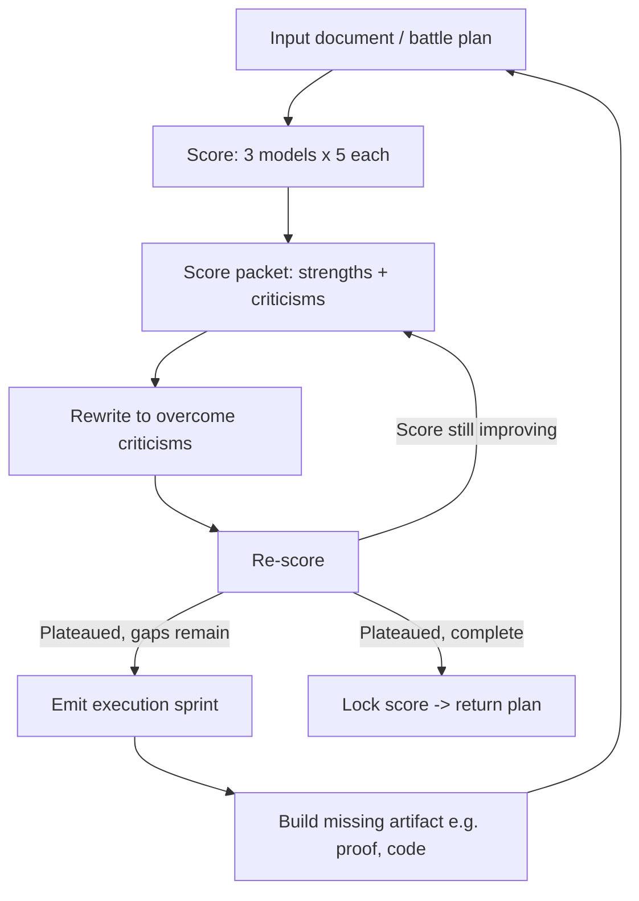
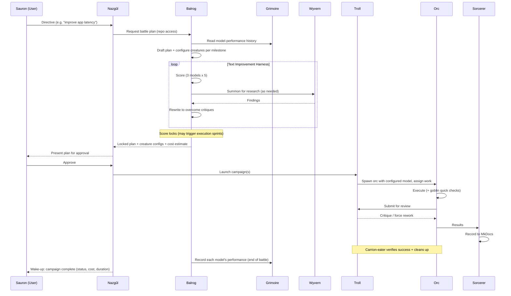

# PF Terminal — Agentic Orchestration Specification

> **Mordor-based hierarchies for multi-model agentic development.**
> A structured way to plan, deploy, and verify multi-agent "sieges" from a single terminal, where each model plays to its strengths under a chain of command — and where the orchestrator *configures* which model fills each role per task.

*Revision 2 — adds configurable creature spawning, the Grimoire, and a configurable planning-tier slot.*

---

## 1. Purpose & Problem Statement

When a human works one-on-one with a single coding agent, two failure modes dominate:

1. **The agent misrepresents completion.** It reports that something is *done* without documenting it or proving it. Verifying the claim often requires building bespoke step-by-step harnesses just to confirm the work finished correctly — expensive when outputs are non-deterministic.
2. **The agent does what you *said*, not what you *meant*.** Literal compliance without intent alignment is a structural problem, not an occasional bug.

Powerful single agents (e.g. Codex, even with large amounts of free API credit) don't fully solve this, because the work still takes days to get right and lacks structural verification.

**PF Terminal's thesis:** introduce a *hierarchy* of specialized agents — borrowing Mordor terminology to encode rank and responsibility — so that planning, execution, adversarial review, research, and documentation are separated into distinct roles. Each role is a **configurable creature**: the planner casts a specific model (with specific params) into each role per milestone, and learns over time which model performs best where. A canonical example of the core insight:

> A top-tier model makes a plan → a very fast model executes it as quickly as possible → a strong reviewer model audits the execution.

The goal end-state: the human stops juggling 28 terminal tabs and instead **talks to a single orchestrator**, which deploys and supervises everything, reports cost and status, and wakes the human when the work is done.

---

## 2. Design Principles

- **Hierarchy as a control structure.** Rank encodes authority, capability, and cost. Higher entities plan and supervise; lower entities execute and check.
- **Archetype ≠ model.** Creatures are *behavioral roles*, not fixed model assignments. Each spawned instance is configured with a specific model + params and bound to a milestone. The same archetype spans many configurations — a "designer orc" on a high-quality model and a "siege orc" on a fast high-throughput model are both orcs. (See §4.)
- **Learned model selection.** Model-to-role fit is recorded after each battle in the **Grimoire** (§5) and informs future configuration, so the system gets better at casting the right model for each job over time.
- **Document-driven flow.** The plan is the engine. Work is scored against the document, and the document's gaps *drive* execution (the Text Improvement Harness, §6). This lets the system operate at a higher order of abstraction when the underlying problem is hard.
- **Right model for the right job, costed.** Planning, execution, review, and research have different cost/latency/quality curves. The orchestration layer assigns models accordingly and tracks token spend per unit of work.
- **Adversarial QA to minimize human review.** Reviewers (trolls) are structurally adversarial to executors (orcs), so most quality enforcement happens before a human ever looks.
- **Verifiability & proof-of-completion.** "Done" must be demonstrable, not asserted. Completion should produce an artifact (a proof, a passing check, a doc entry).
- **Rendered docs over terminal sludge.** State and results live in an in-repo, nicely rendered **MkDocs** site that is kept continuously correct.

---

## 3. The Bestiary (Entity Ontology)

The hierarchy, top to bottom. Each entity is defined to be **prompt-ready**: mandate, authority (what it can summon/command), inputs/outputs, and default model are spelled out so each can be turned directly into an agent system prompt.

| Entity | Role (one line) | Managed / summoned by | Can summon / command | Default model* |
|---|---|---|---|---|
| **Sauron** | The human user; the will/intent | — | The Eye / Nazgûl | (human) |
| **The Eye ("I")** | Interface that conveys intent to the Nazgûl | Sauron | Nazgûl(s) | Task node / automation |
| **Nazgûl** | Orchestrator the user talks to; lives in one PF terminal | Sauron (via the Eye) | Balrog; presents campaigns | Planning-tier (e.g. Fable) |
| **Balrog** | Planner; configures & spawns creatures; runs the harness; owns the Grimoire | Nazgûl | Wyverns; all configured creatures | Planning-tier (Fable / `5.5 Pro MX Thinking`) |
| **Troll** | Adversarial QA / foreman over orcs | Balrog (via battle plan) | Orcs; Wyverns | Strong reviewer (e.g. Codex) |
| **Orc** | Executor; does the work | Troll | Goblins | Per-instance (e.g. Opus 4.8 / GLM 5.2 Fast) |
| **Goblin** | Fast sanity checks (quick review, bug sweep) | Orc | — | Cursor Composer 2.5 |
| **Wyvern** | Researcher / web + academic search | Balrog or Troll | — | Claude + Deep Research |
| **Golem** | Always-on background daemon | (standing) | — | OpenRouter free model |
| **Sorcerer / Scribe** | Records campaign results to MkDocs | Nazgûl / campaign | — | (configurable) |
| **Carrion-eater** | Campaign-completion QA / **cleanup** | Nazgûl / campaign | — | (configurable) |

\* *Models shown are defaults/examples. Per §4, the Balrog configures the model + params of each spawned instance and binds it to a milestone; the Grimoire (§5) informs those choices.*

### 3.1 Sauron — the human user
The source of will and intent. Sauron does not operate at the level of providers, cost curves, or individual agents. Sauron issues a directive (e.g. *"make my app's latency better"*) and approves plans.

### 3.2 The Eye ("I") — the interface
The mechanism by which Sauron conveys information to a Nazgûl. Concretely this is the **task node**: a piece of software where humans interact with the AI system. In the simplest case the Eye is the direct TUI link between Sauron and one Nazgûl. In a more automated future, the Eye can listen to the human (or an automated system) and direct **multiple** Nazgûl on Sauron's behalf.

### 3.3 Nazgûl — the orchestrator
The entity the user interacts with directly. **A PF terminal and a Nazgûl are a unified entity: at most one Nazgûl per PF terminal.** Direct human↔Nazgûl communication happens in the TUI. The Nazgûl:

- Receives a directive from Sauron.
- Queries the **Balrog** to produce a battle plan.
- Returns the locked plan to Sauron for approval, including the campaigns, **configured creatures**, gates, and **cost estimate**.
- Supervises execution and answers status questions ("What's the state of the campaign right now?").

**Remote reach:** the Nazgûl is connected to a **wallet linked to Nostr**, so Sauron can message it from a phone, Slack, or elsewhere — and the Eye can message it too. The user can request a report from the Nazgûl remotely.

**Concurrency:** in practice a user manages one Nazgûl at a time; the model allows up to ~13 Nazgûl theoretically, ideally coordinated by the Eye. **The Nazgûl is open source.** It runs on the **planning-tier slot** (§4.2) — the same tier as the Balrog.

### 3.4 Balrog — the planner & caster (core IP)
More powerful than a Nazgûl. The Balrog has **repo access** and is the system's planning and casting authority. It:

- Drafts the initial battle plan and improves it via the **Text Improvement Harness** (§6).
- **Configures and spawns every creature** (§4): for each milestone/gate it chooses the archetype, the model, the params, and any specialization, then binds the instance to that milestone.
- Is the **primary Wyvern summoner**, calling multiple Wyverns to strengthen a plan.
- Defines the *terms of the battle* in advance: number of synchronous jobs, trolls, orcs per troll, victory conditions.
- **Reads the Grimoire (§5)** when configuring creatures, and **updates it at the end of a battle** with how each model performed.

**Visibility & monetization:** the Balrog (and the harness it runs) is **invisible to the user but available on demand**, and **expensive**. It is intended to remain **closed-source / paid IP** — potentially free to a specific user tier. *(See open questions §10.)*

### 3.5 Troll — adversarial QA / foreman
A troll **does not work and does not fight** — it supervises orcs. It receives the battle plans defined by the Balrog and:

- Keeps orc output lean: no bloat, no hacks, no structural weaknesses, fast.
- Is critical of orc work and forces rework until quality bars are met.
- May **summon a Wyvern** if worried about quality (e.g. *"is this orc rebuilding something that already exists?"*).

The troll is structurally **adversarial** to the orcs it oversees.

### 3.6 Orc — executor
A worker that just gets things done. Orcs do the actual building. Their behavior is fixed (execute), but their **configuration varies per instance** — the Balrog casts an appropriate model + specialization for each milestone. Examples:

- **Designer orc** → a high-quality model (e.g. Claude Opus 4.8) for design-heavy work.
- **Siege orc** → a fast, high-throughput model (e.g. Vercel GLM 5.2 Fast) for a gate that needs a lot of power.
- **Elite orc** → a premium fast model for throughput-critical work.

Orcs frequently introduce errors (hence trolls), so before escalating an orc can deploy a **goblin** for a fast self-check.

### 3.7 Goblin — fast checks
Does quick, lightweight tasks: a fast code review or bug sweep so an orc can sanity-check its work before escalating. Default model: **Cursor Composer 2.5** (very fast, error-prone, good for speed-critical quick passes).

### 3.8 Wyvern — researcher
Goes and finds information: a web/academic searcher that should know about academic papers. **Claude Deep Research is a very powerful Wyvern.** Recommended implementation: use the Claude agent harness in the PF terminal, invoke the Deep Research plugin, and load in a web agent. Summoned mainly by the Balrog (to improve plans) and by trolls (to validate orc approaches).

### 3.9 Golem — always-on daemon
A background process that runs around the clock. Default model: a **free OpenRouter model** (configurable). Example duties: permanently scanning every repo for security problems; keeping the MkDocs continuously correct.

> **⚠ Constraint:** free models are given away in exchange for training on their inputs. **Golems must only operate on open-source repos, never sensitive ones.** This constraint is part of every Golem's configuration.

### 3.10 Sorcerer / Scribe — documentation
A scribe that records the results of each campaign into the **MkDocs** site. It should never be the case that the docs are confusing. Works alongside the Golem responsible for doc correctness.

### 3.11 Carrion-eater — campaign QA / cleanup *(confirmed)*
The **cleanup** entity. After a campaign completes, the Carrion-eater verifies the campaign actually succeeded and clears the carrion — leftover scaffolding, dead branches, temp artifacts, and loose ends — distinct from a goblin's fast in-flight check.

---

## 4. Creature Configuration & Spawning

The central architectural pattern: **archetypes are templates; instances are configured and spawned against milestones.** The Balrog is the sole configurator.

### 4.1 The configuration model

Every spawned creature is an **instance** defined by:

- **archetype** — the behavioral role (orc, troll, goblin, wyvern, golem, sorcerer, carrion-eater).
- **specialization** — an optional free-text purpose tag (designer, siege, elite, security, …).
- **model** — provider + model id.
- **params** — reasoning/thinking effort, temperature, tools, context, etc.
- **bound_to** — the milestone / gate this instance serves.
- **constraints** — e.g. Golems → open-source repos only.

```yaml
# A spawned creature instance
id: orc-design-01
archetype: orc
specialization: designer          # designer | siege | elite | security | ...
model: anthropic/claude-opus-4.8
params:
  reasoning: high
  tools: [repo, editor]
bound_to: gate/ui-redesign        # the milestone this instance serves
spawned_by: balrog

---
# A heavy-power siege orc bound to a demanding gate
id: orc-siege-04
archetype: orc
specialization: siege
model: vercel/glm-5.2-fast
params:
  reasoning: medium
  throughput: high
bound_to: gate/index-rebuild

---
# A standing background golem (open-source repos only)
id: golem-sec-01
archetype: golem
specialization: security
model: openrouter/<free-model>
params: { schedule: continuous }
constraints: [open_source_only]
bound_to: standing
```

The Balrog emits these configs as part of the battle plan, so the plan a human approves shows exactly **which model is doing what, where, and at what cost**.

### 4.2 The planning-tier slot (Balrog & Nazgûl)

The **Balrog and the Nazgûl share the top-tier "planning" slot** — and that slot is itself configurable. Current candidates:

- **Fable**, accessed via a **max-thinking API call** — the most likely Balrog.
- **`5.5 Pro MX Thinking`** — currently used as a Balrog.

The precise **ranking among planning-tier candidates is unresolved** (and whether the Balrog and Nazgûl should ever run different models from each other). See §10. The intent is that, like every other creature, the planning slot is a configurable field rather than a hardcoded choice.

---

## 5. The Grimoire (model-performance memory)

The Grimoire is the system's **institutional memory about model performance** — the feedback loop that makes casting smarter over time.

- **Owned by the Balrog.** Read at plan time to inform creature configuration; written at the **end of a battle** with observations about how each model performed in each role.
- **What it records (proposed):** per (archetype × model × task-type), signals such as quality score, gate pass/fail, rework rate, latency, and token cost. *(Exact schema is open — §10.)*
- **How it's used:** when the Balrog configures creatures for a new milestone, it consults the Grimoire to pick the model that has historically performed best for that archetype/task at an acceptable cost — e.g. "designer orcs on Opus 4.8 passed UI gates first-try 80% of the time; siege orcs on GLM 5.2 Fast cleared heavy gates fastest per dollar."

This closes the loop: **Grimoire → creature configuration → battle execution → recorded performance → Grimoire.**

---

## 6. The Text Improvement Harness (Balrog's engine)

The mechanism by which the Balrog raises the quality of any document — most importantly the **battle plan** itself. This is the core, closed-source IP.

**Loop:**

1. **Score.** Take the input document and score it with **three separate models, five times each**.
2. **Score packet.** Aggregate into a packet listing concrete **strengths and criticisms**.
3. **Rewrite.** Feed the packet into a rewrite explicitly designed to **overcome the criticisms**.
4. **Re-score.** Score the rewrite the same way.
5. **Repeat** until the score plateaus.
6. **Execution sprint (escalation).** When the score taps out but gaps remain, the harness emits an instruction to **go build the missing element**, then reintegrate the result and re-score. The document plateau *drives real work*.

**Worked example — cryptographic white paper:** a white paper is scored; a missing element is identified (e.g. *proof that the construction exists*); the harness directs construction of the proof; the proof is loaded back into the paper; the score rises. A quality gap becomes a concrete buildable task.

**In the PF Terminal context, the document under improvement is the battle plan.** The harness iteratively scores and improves the plan (with multiple Wyvern surveys), then the **score is locked** and the plan is sent to the Nazgûl for human approval.



---

## 7. Control Flow / Campaign Lifecycle

End-to-end, from intent to completion. Note the Grimoire reads/writes and per-milestone creature spawning:



Throughout, **Golems** run continuously in the background (security scans, doc-correctness) independent of any single campaign.

---

## 8. Data Model / Artifacts

The nouns the system tracks. *(The transcript uses "siege" and "campaign" loosely; the hierarchy below is a proposed normalization — see §10.)*

- **Battle Plan** — the master artifact produced by the Balrog. Iteratively scored and improved via the harness, then **locked**. Embeds every campaign, siege, gate, **creature config**, and a cost estimate.
- **Creature Instance** — a configured, spawned agent (§4): archetype + specialization + model + params + milestone binding + constraints.
- **Campaign / Siege** — a major initiative within the plan (e.g. *"the Siege of Rivendell"*). Each carries: a **2-sentence description**, a defined **victory condition**, the **creatures deployed**, **human-review gates**, **cost** (tokens + approx price), and **duration**.
- **Gate** — a checkpoint/milestone within a campaign that creatures are bound to, including human-review gates that mark whether the campaign is good.
- **Battle definition** — the Balrog's up-front parameters: synchronous jobs, count of trolls, orcs per troll, etc. The plan's **score incorporates these definitions**, so the structure of the battle is itself graded.
- **Grimoire** — persistent model-performance memory (§5); read at plan time, written at battle end.

---

## 9. Product / UX Requirements (PF Terminal)

**Single-orchestrator interaction**
- The user talks to **one Nazgûl** in one pane (the TUI). Ask it anything: *"What's the state of the campaign?"* → it reports which orcs (and which models) are on which task and what's ready for review.
- Eventual end-state: the user simply **texts the Nazgûl**; it replies with what's being deployed, the siege document, costs, and the creatures assigned to each step — then **wakes the user when complete**.

**Campaign visibility**
- A `/siege` (or `/campaign` — name TBD) view listing all active campaigns.
- Each entry shows a ~2-sentence description, the deployed creatures (archetype + model), and current activity.
- Per-campaign: victory definition, status, human-review check marks, **cost**, and **duration**.

**MkDocs-native documentation**
- MkDocs lives **inside the repo** — not a separate product. Rendered as a clean, viewable site with a **standardized base structure**. Kept **continuously correct** (Golem + Sorcerer responsibility).

**Remote / multi-channel access**
- Nazgûl ↔ wallet ↔ **Nostr**, enabling messaging from phone, Slack, etc. Remote report requests; completion wake-ups.

**Integrations & providers**
- Existing: **Codex** and **Claude Code** integrations (the system originated using tmux pane injection to manage another agent when Fable launched).
- Wanted: a **Cursor** integration.
- Underneath, Codex / Claude Code iterate with many OpenRouter models and other providers; the orchestration layer handles **provider selection and cost curves** — informed by the Grimoire — so the user doesn't have to.

---

## 10. Open Questions & Decisions To Make

**Resolved since revision 1**
- ✅ **Carrion-eater** = the cleanup / campaign-completion QA entity (name locked).
- ✅ **Creatures are configurable per instance** — archetype + model + params + milestone binding, cast by the Balrog (§4).
- ✅ **Fable is the planning-tier model** for both Balrog and Nazgûl; the planning slot is a configurable field.

**Still open**
1. **Planning-tier ranking.** Among planning-tier candidates — **Fable (max-thinking API)** vs **`5.5 Pro MX Thinking`** — what's the ranking, and should the Balrog and Nazgûl ever run *different* planning models from each other? (User: "idk the hierarchy.")
2. **Grimoire schema & scope.** Which performance signals are recorded (quality score, gate pass/fail, rework rate, latency, token cost?), how does the Balrog weigh them when configuring, and is the Grimoire **per-repo, per-user, or global/shared**?
3. **Siege vs. campaign vs. gate.** Confirm the hierarchy (proposed: Battle Plan → Campaigns [named instances = Sieges] → Gates) and pick canonical nouns.
4. **Slash-command naming.** `/siege`? `/campaign`? Define the command set.
5. **Balrog monetization & openness.** Closed-source paid IP, free to a specific tier, or a self-running variant that avoids per-call API payment?
6. **Crypto-vault transparency.** Define the trust/transparency model for the wallet + Nostr layer so vault management is auditable.
7. **Concurrency limits.** How many Nazgûl (≤13?), trolls, and orcs per troll per battle — Balrog-set at plan time vs. user override?
8. **Cost/quality heuristics for casting.** Default rules for when to spend on a premium model vs. a cheap one per milestone — the thing the Grimoire should eventually learn and automate.
9. **QA bar for low human review.** Concretely, what gates (Carrion-eater verification + goblin checks + troll review) let a campaign pass with minimal human review?

---

*Document status: revision 2, derived from a brainstorming transcript plus follow-up refinements. Recommendations and proposed normalizations are flagged inline and consolidated in §10. A short segment of unrelated/garbled audio in the original recording was omitted as accidental capture.*